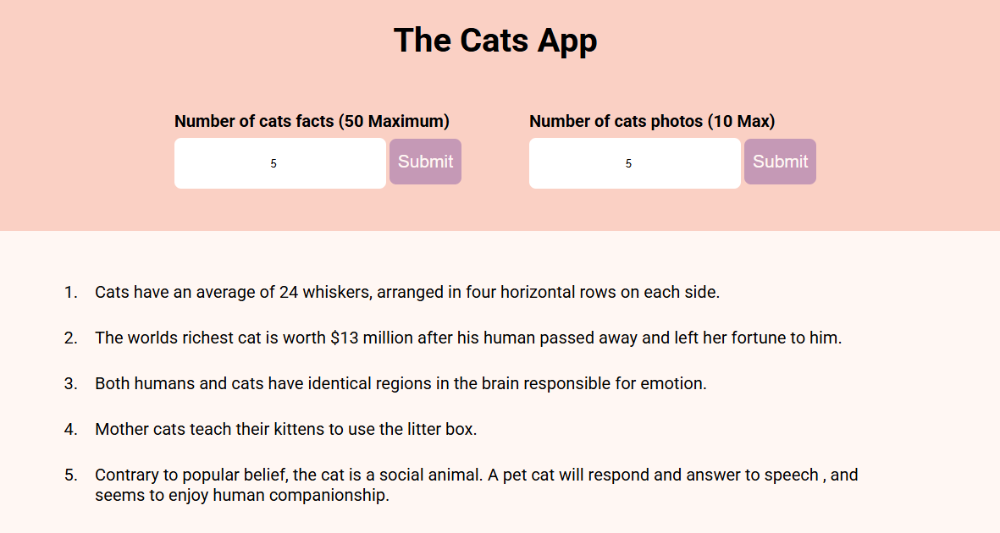

# 😸 Random Cat Facts & Image App

This is a simple, responsive web application that displays random cat facts and images using the [Catfacts](https://meowfacts.herokuapp.com/) and  [the Cat image](https://thecatapi.com/) APIs respectively. Built with HTML, CSS, and JavaScript. It features fetching data using axios.



## 🛠️ Features

- Fetch and display random cat facts 
- Generate random cat images
- Async data fetching with Axios  
- Loader animation for visual feedback 


## Getting Started

To run this project Locally:

### Step 1: Clone the repo

```bash
git clone https://github.com/KE-FA/Cat-App.git
```

### Step 2: Navigate into the project folder

```bash
cd Cat-App
```

### Step 3: Install dependencies

```bash
npm install
```

### Step 4: Run the development server

```bash
npm run dev
```